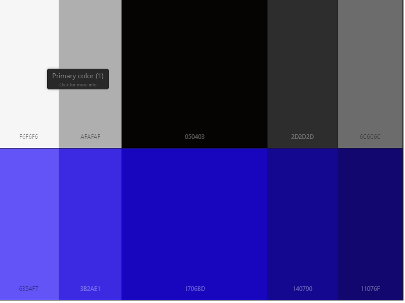

# Colour Scheme 

## Color schemes I may use:
- Dyadic 
- Monochromatic
- Complamentary 

## Palette:
- 6+ colours
- URL

## How i plan to use them:
- Font color
- Background
- Navigation bar background
- Border for banner
- Entire website background

## Common mobile phone website colour schemes:
- Black and white
- Navy and white
- White and purple
- Black and blue/navy 
- Orange and black 

## Why these colour schemes
I believe these colour schemes are more suitable for a mobile phone website because unlike the colour schemes like triadic and tetradic, they are much more simple due to their lack of colour variety but that's what makes them look more neat and professional, which is what I am aiming for since this website is directed at adults. Additionally, my website will include images of mobile phones which will obviously have their own colours, so them colours in the images in addition with an extremely colourful colour scheme on my website would have a result of my website looking very unprofessional and disorganised.

## Color Schemes I may not use:
- Triadic
- Tetradic

## Why not these colour schemes
These colour schemes are mostly used for websites that are directed at younger ages or adults that have children that would use the website that has these colour schemes. This is mainly because these colour schemes contain a lot of colours to appeal to children but they are the simple colours such as red, blue, green and yellow because they are very bright which is mostly the reason they appeal to children or it can help them navigate when they are using the computer. My website however is targeted at mostly adults so i wouldn't be using a large variety of colours like these because it would make the website look more chaotic and untidy. 

# Chosen Colour scheme

This colour scheme suitable for my website mainly because it's not too chaotic and doesn't have alot of bright colours. The only colour that isn't black or white is the colour blue which I believe is a great choice because I thought that it is very associated with the online world because it's a very common colour used in it. This type of colour scheme is monochromatic and it contains two types of colours within it. Black is going to be the background colour of the web pages and it may have a slight bit of light grey mixed with it at the bottom half of they page getting progressively lighter as you scroll down, white will be the font colour so that the text is very visible. Blue will be the colour of any interactable content in the website e.g. buttons, hyperlinks, dropdowns, tables.

# Alternate colour scheme

 
This palette is my alternate colour scheme but I won't be using it as my main one because of the following reasons. Firstly, the colours are much more random then the original, probably due to the fact that this colour scheme is triadic and the original is monochromatic. The fact that there are more colours to be added because of the images of the phones will make this website be overwhelmed by a large variety of colours and it would have simply too many and it would look unprofessional for an online phone shop. Additionally, I don't see these colours mixing together very well on this website because all four of them are completley different types of colours on a palatte.