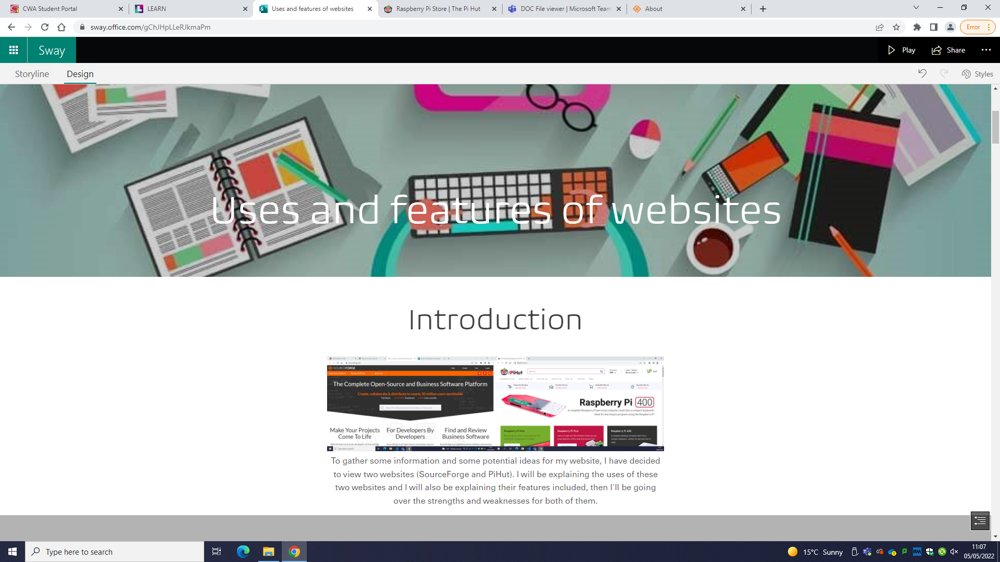

# Layout

After evaluating two other websites on microsoft sway, I have now decided to make some ideas for the layout of my own website.

## Home page content:
- Slide show of products
- Introduction to website
- Best/popular deals
- Navigation bar
- View reviews button

## Navbar hyperlinks:
- Home 
- Shop
- Help and Advice

## Banner content:
- logo
- Star rating 
- slogan

## Layout elaboration 
Firstly, as a user opens up the website the first thing they will see is the nav bar, I will have it at the top of the page so that it is easy to find and it would visually look better being above the content that the web page contains rather than being anywhere else. A slide show would be good on a home page and underneath thye nav bar rather than the images of best deals coming first since a slide show feels more like an introduction and gives customers a great understanding of what the website has to offer. Somewhere around the bottom of the web page I could have a little introduction to the website where it just tells customers what is the purpose of this website and what it specificly sells, another opstion is that I could have it on a seperate web page called 'about us'. If I do have it on the home page I will not place it at the top because some customers might not be interested in reading it and it would get in the way of the slide show or other information they might be expecting to see on the home page. In summary I would most likely leave all of the details about the website and reviews at the bottom and on seperate web pages and have the products at the top and being the most visible to customers when the frist open the website.

## Other web pages
Secondly, the other web pages such as the shop, help and about us web pages etc, will have the banner and the navigation bar just like the home page obviously so that any users can navigate from web page to web page. The layout that is underneath the nav bar and banner for each of these web pages will depend on what content the web page contains. For example, the shop web page will obviously have a variety of images so that the products can be showcased to users, they will be organised in rows to make the web page seem neat. For any other web page like help, about us or reviews will have similar layouts since their web pages mainly consist of details and writing, they will just a simple layout e.g. the about us page content will be organised in paragraphs containing different information as a user scrolls down the web page. The review web page will obviously have all the reviews in a list like structure going down the web page but at the top there will be two options for the user to either read the good or bad reviews. The help web page will be almost the same as the about us page except there will be options at the top where there are hyperlinks that will take them to another web page that contains the information to help them with a certian topic they don't understand entirely well e.g. navigation, contact us how to order etc. 

## Mobile version
Lastly, I have acknowleged the fact that not everyone may be able to access this wesbite since not everyone has a PC or laptop, so I am making a mobile version which is obviously exclusive on mobile phones. The mobile version of this website will contain the same content as the original, so I am going to only have to change the sizes of the contents obviously so that they can fit on a phone screen. Since I am changing the sizes of the contents within the website this will mean that the mobile version will have a slightly longer scroll down than the original version since I may have to change the height after changing the width of certain contents to make them look organised. Some of the content on the mobile version won't be compressed properly if you make the tab on your PC smaller but this won't be a big deal because it's obviously not meant for PC and this won't happen on an actual mobile phone, it's just the content on a layout the same shape as a mobile phone.
