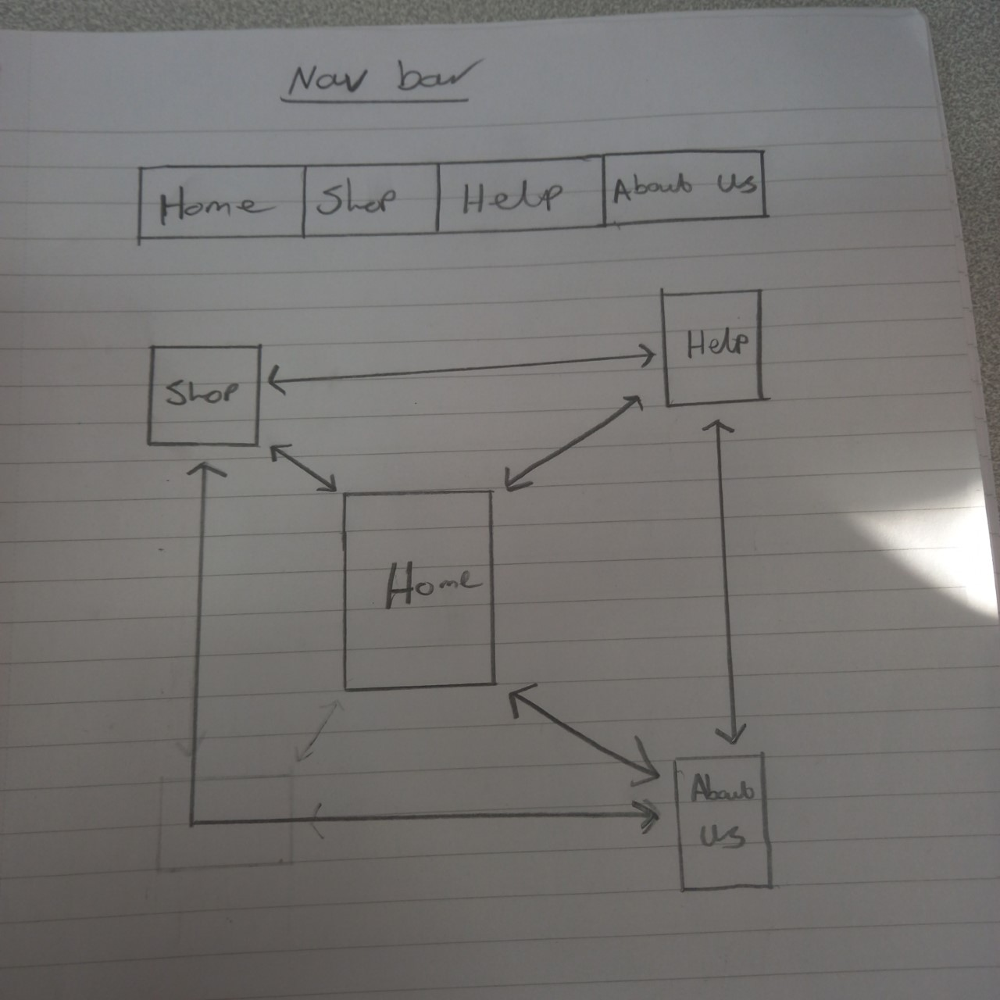
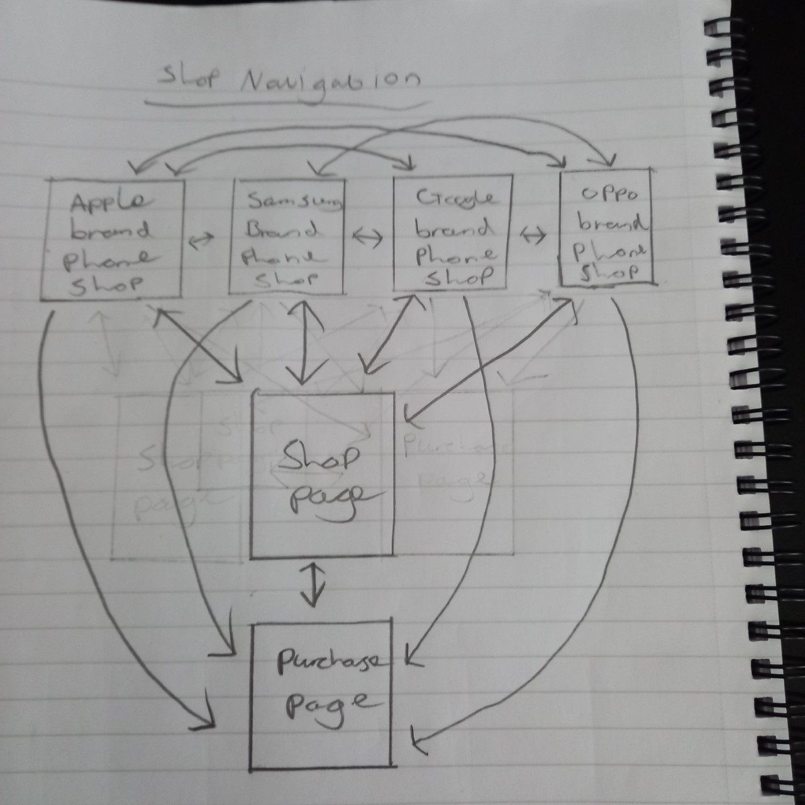
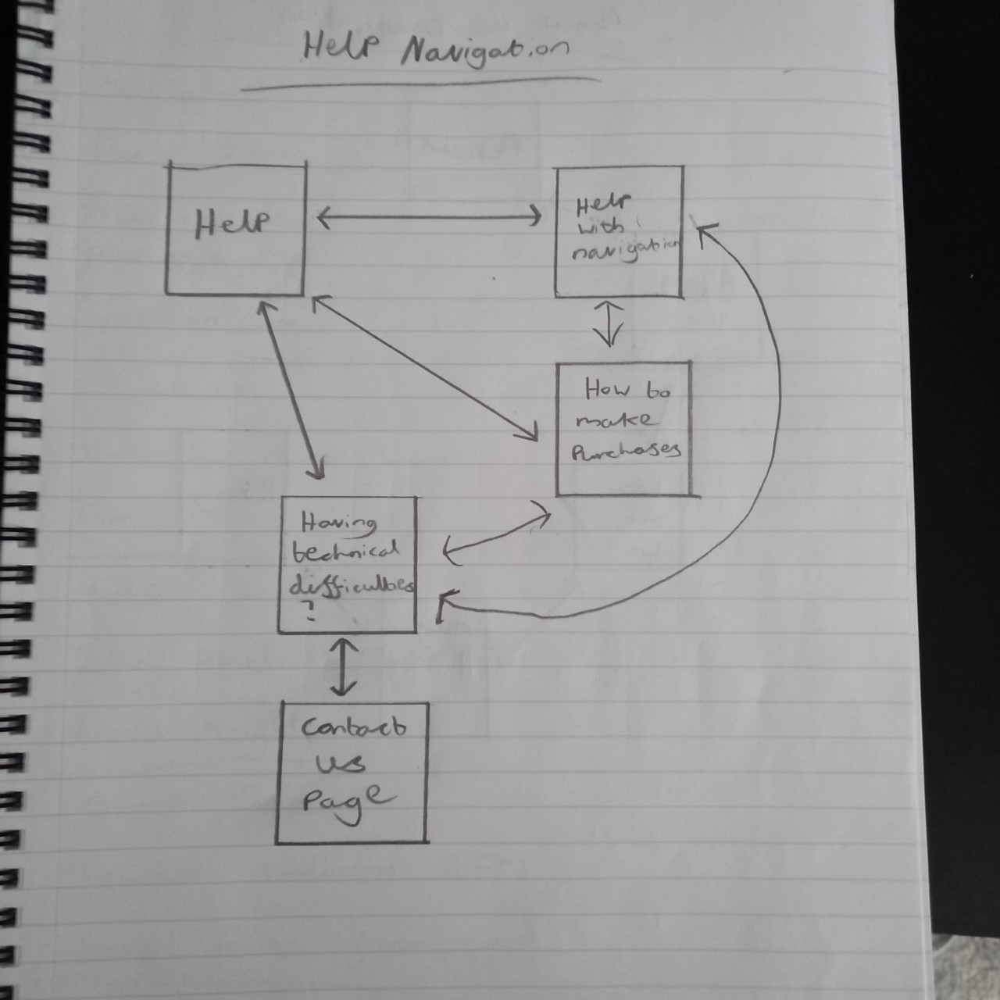
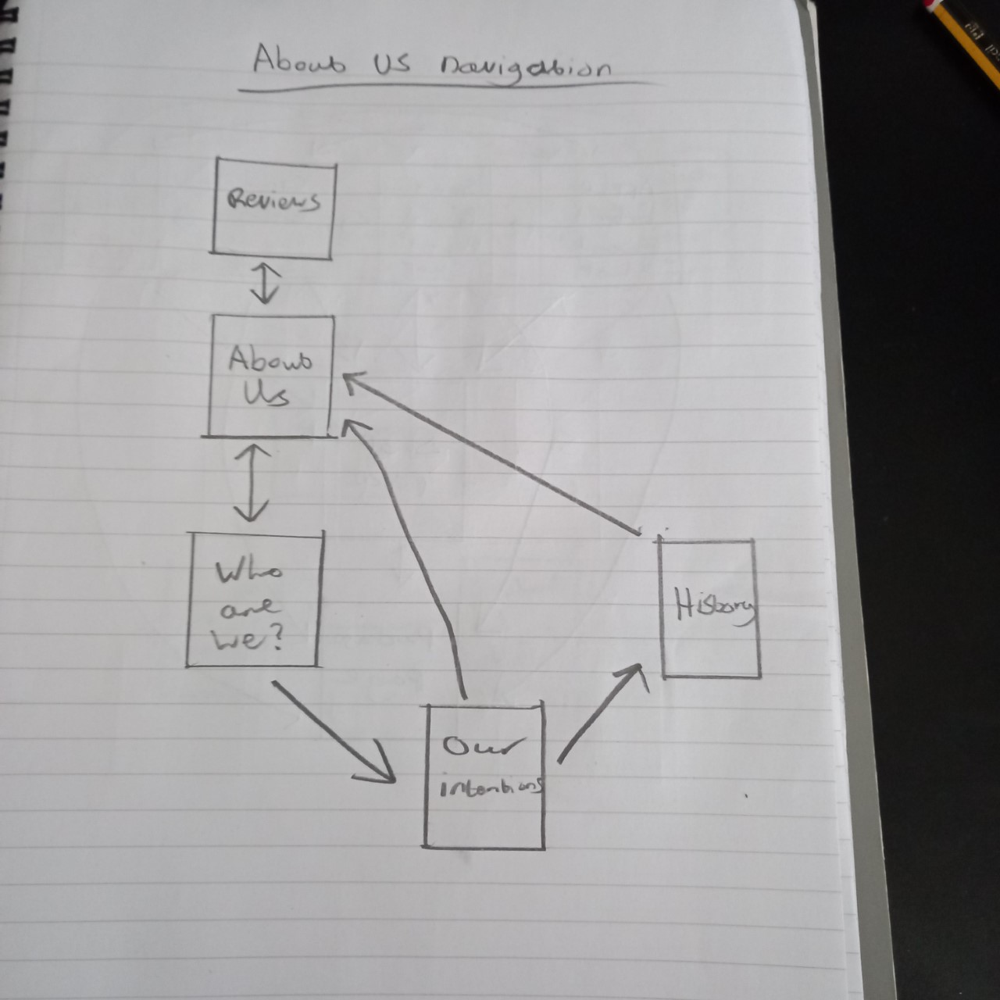

# Navigation Bar/Main web pages

## Go to table

|   |  Home |  Shop | Help  | About us  |
|---|---|---|---|---|
| Home  | &#x2611; | &#x2611;  | &#x2611;  | &#x2611;  |
| Shop  | &#x2611;  | &#x2611; | &#x2611;  | &#x2611;  |
| Help  | &#x2611; | &#x2611;  | &#x2611;  | &#x2611;  |
| About us | &#x2611;  | &#x2611;  | &#x2611;  | &#x2611;  |

## Summary

All of the main web pages that are contained in the nav bar will all be linked together because the nav bar is the main source of navigation in the website, so it would be ideal to have all of them web pages connected together.

# Shop web page Navigation 

## Go to table 

|   | Shop  | Samsung Brands  | Apple brands  | Google brands  | Oppo brands | Purchase page |
|---|---|---|---|---|---|---|
| Shop  | &#x2611;  | &#x2611;  | &#x2611;  | &#x2611;  | &#x2611;  | &#x2611; |
| Samsung brands  | &#x2611;  | &#x2611;  | &#x2611;  | &#x2611;  | &#x2611;  | &#x2611; |
| Apple brands  | &#x2611;  | &#x2611;  | &#x2611; | &#x2611; | &#x2611;  | &#x2611; |
| Google brands | &#x2611; | &#x2611; | &#x2611; | &#x2611; | &#x2611; | &#x2611; |
| Oppo brands | &#x2611; | &#x2611; | &#x2611; | &#x2611; | &#x2611; | &#x2611; |
| Purchase page | &#x2611; | &#x2612; | &#x2612; | &#x2612; | &#x2612; | &#x2611; |

## Summary

These are all of the web pages that are only accessible after opening the shop web page, so the table and diagram won't include the web pages in the nav bar. After opening the shop web page there are four optional web pages, each of the four web pages contain different phone brands e.g. Samsung, Apple, Google, Oppo.
There is one more web page that can be opened only if a user is on any of the phone brand web pages, this is accessible on the shop web page and the other four and that is the purchase page so that a user can look at further deatils for the product they want to buy, this page won't be done but i'll leave a message on that page to notify any user that goes on there.

# Help web page Navigation

## Go to table

|   | Help  | Help with navigation  | How to make purchases  | Having technical difficulties? | Contact Us
|---|---|---|---|---|---|
| Help  |  &#x2611;  |  &#x2611;  |  &#x2611;  |  &#x2611; |  &#x2612; 
| Help with navigation  |  &#x2611;  |  &#x2611;  |  &#x2611;  |  &#x2611; |  &#x2612; 
| How to make purchases  |  &#x2611;  |  &#x2611;  |  &#x2611;  |  &#x2611; |  &#x2612; 
| Having technical difficulties? |  &#x2611; |  &#x2611; |  &#x2611; |  &#x2611; |  &#x2611;
| Contact Us |  &#x2612; |  &#x2612; |  &#x2612; |  &#x2611; |  &#x2611; |

## Summary

When a user opens the help web page they will be able to also open 3 other web pages which are: Help with navigation, How to make purchases and Having technical difficulties? The navigation page obviously helps users out with how the navigation system works, the purchasing page tells them how to purchase items and the technical difficulties page will just explain to a user what to do if anything goes wrong with the website. There is also the contact us page which is only accessible through the technical difficulties web page.

# About us web page navigation

## Go to table

|   | About us  | Reviews  | Who are we?  | Our intentions  | History |
|---|---|---|---|---|---|
| About us  | &#x2611;  | &#x2611;  | &#x2611;  | &#x2612;  | &#x2612;  |
| Reviews  | &#x2611;  | &#x2611;  | &#x2612;  | &#x2612;  | &#x2612;  |
| Who are we? | &#x2611;  | &#x2612;  | &#x2611;  | &#x2611;  | &#x2612;  |
| Our intentions | &#x2611; | &#x2612; | &#x2612; | &#x2611; | &#x2611; |
| History | &#x2611; | &#x2612; | &#x2612; | &#x2612; | &#x2611; |

## Summary

When a user opens the 'about us' web page there will be two other web pages that they can open and those are 'reviews' and the 'Who are we?' web pages. There are no more web pages after the 'reviews' web page and the only option is to go back to the 'about us' web page. However, in the 'Who are we?' web page there is another web page that can be opened called 'our intentions' and the 'history' web page. Whilst going through these web pages you can't go back through them, you'll have to go through them all the way to the end of the 'history' page to click on the button to go back to the start. However, on each of these web pages the nav bar is still at the top, so you can click back onto the 'about us' page (including all of the other pages on the nav bar) whilst on any of the help pages instead of having to go through them all. 
