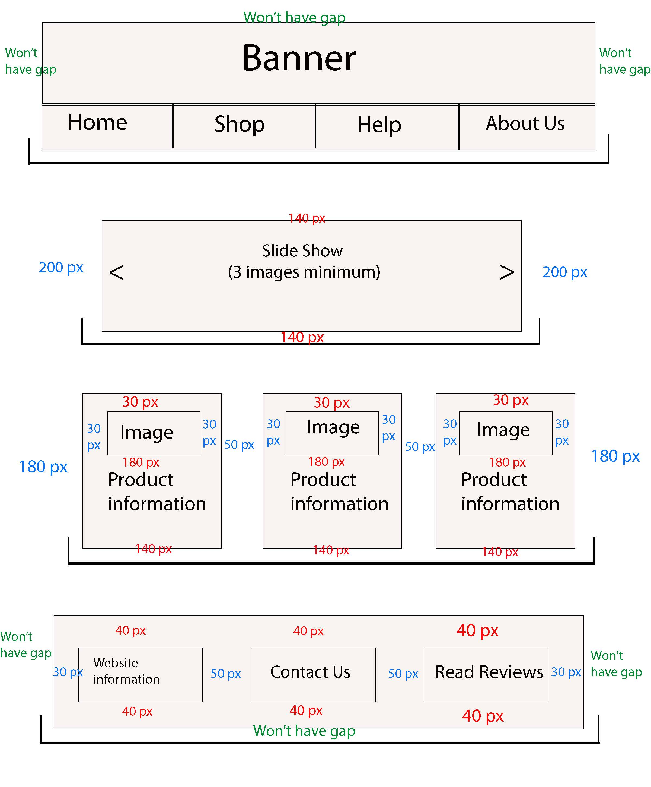
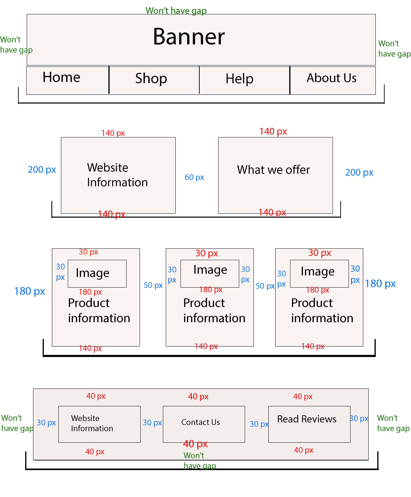
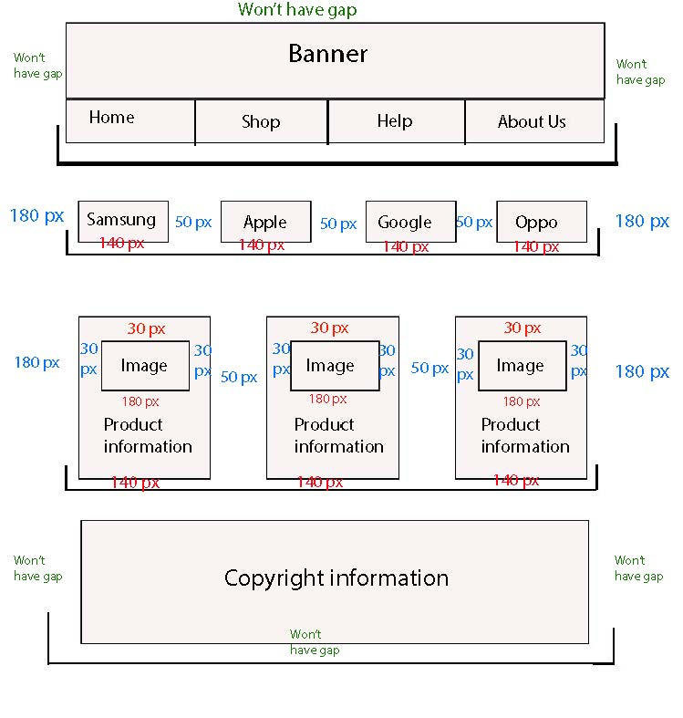
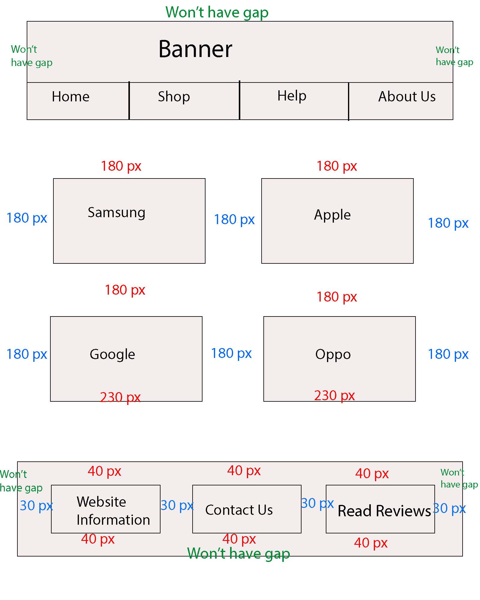
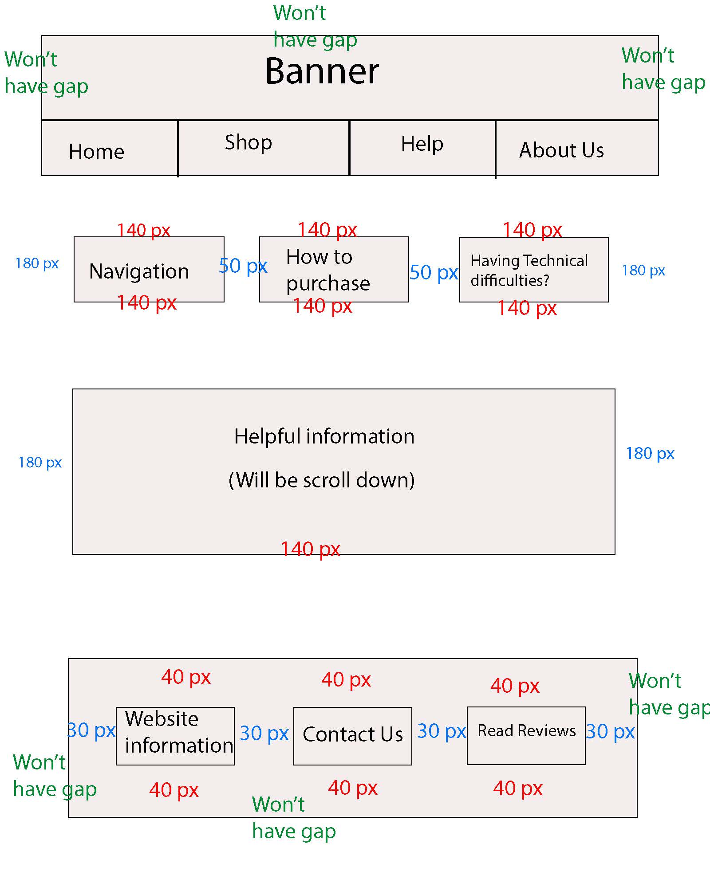
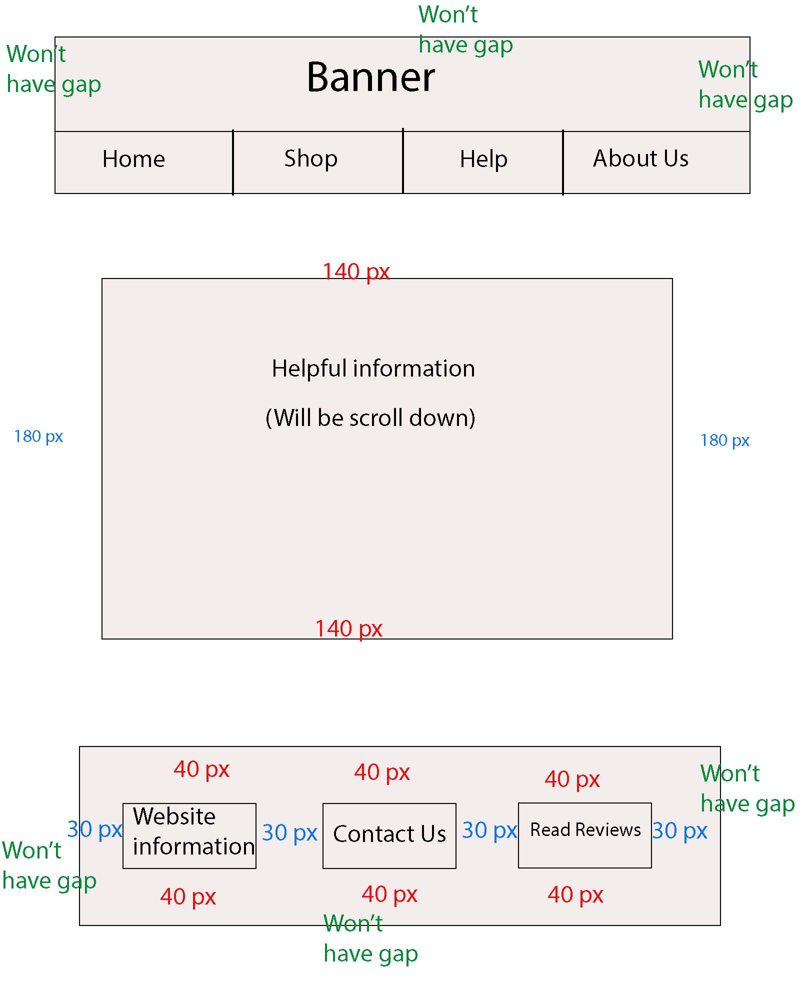
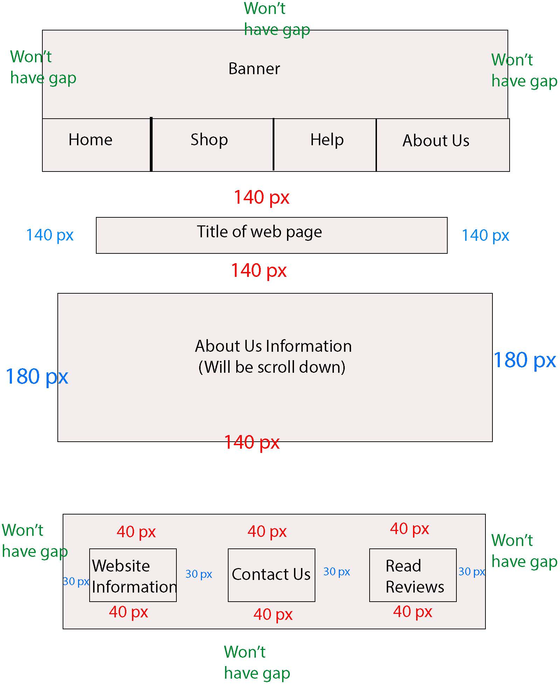
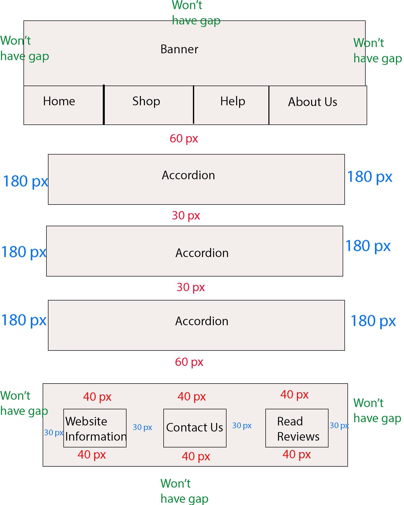

# Website Home Page Storyboard

# Elaboration

## Banner and Nav Bar

This image is the storyboard for the home page of my website and this is the deisgn I am most comfortable with using. Like all websites, I have the banner at the top with a navigation bar just underneath so that the navigation for the website is very simple to locate. My banner includes the logo and website name so that the banner introduces the customers to the name and logo of the website as soon as the load up the home page, also the star rating is there at the top as well, this is so that the customers get a good impression because the a great star rating indicates to them that your website is reliable. The nav bar includes what customers would expect for a shopping website; home, shop, help and about us. I kept the options in the nav bar as simple as possible and I didn't include a lot of options because it could get confusing for some users.

## Middle section/Products showcase

The middle section of the home page is used to show off the products so that my website grabs the attention of anyone that opens up the website, this is the main use of the slide show which is located at the top of the middle section, the images may contain an item that they need or want, after that they will have a great reason to look through my website. Another way customers may have their attention drawn to my website is that the prices of the products (underneath the best deals header) may also appeal to them because they could believe they're understandable prices, this will also make a great impression since it highlights that the websites prices are very reasonable. 

## Footer Section

In the footer section I have included only a little bit of website information because customers may not be interested and it would be best to have it at the bottom where the customers would unlikely look, I also have a seperate web page for that. I have also included a button hyperlink that says read reviews which will take the user to a seperate web page that contains a group of reviews that may convince them that the website is reliable and helpful. Like other shopping websites I included some copyright information because it helps to warn users about copyright laws but I placed it at the bottom of the home page because like the website information, customers may not be interested. Also a contact us option is there which will include the following social media; instagram, snapchat, discord and facebook. 

## Sizes and measurements

Starting off with the banner and nav bar, they will both have the same width which will be 100% because I want them to go across the whole way on the web page which is very common with other websites, their height will be different however and the banners height will be vh and the nav bars will be vh, the banner will be taller because it would probably contain more content than the nav bar. There will be no gap inbetween the banner and nav bar, they will be completely connected.

The slide show will be fairly big with a width of 80% and a height of vh. This is because of the slide shows purpose and that is to showcase the best selling products so it would be ideal to have it stand out. 

The images underneath the slide show will be contained in cards so with text which describes the product so the width of the images will be % and the height will be vh so that all of the content within the cards can fit perfectly. The width of the cards will be % and the height will be vh because there will be three of them that will be in a row with about {} between them, so these sizes allow them to fit in the web page. 

The entire footer section will have a width of % and a height of vh. The size given to the footer section is large enough to hold a decent amount of content such as the website information, read reviews button and any contact us hyperlinks. The box that contains the contact hyperlinks will be the same size of the read reviews button with a width of % and a height of vh.

# Alternate Home Page Storyboard

# Elaboration

## Nav Bar and Banner

Firstly, for my alternate home page design I switched the nav bar and banner around so that the na bar comes first before the banner. I prefer the original design mainly because it's a more common design used by other websites and it looks more appealing and organised. The website name and logo kind of works like titles, they should be at the top where they are above all of the home pages content. 

## Website info and Product Showcase section

This time in this alternate design I replaced the slide show with a wbsite introduction which explains what the website offers. Although this does provide excellent information about what the website s used for but it does get in the way, what I mean by that is that users/customers most likely won't be interested in reading content like this because most people like to get straight to the products that the website has to offer, so for that to be the replacement for the slide show and to be above the best deals section gives the website a boring vibe. In te product showcase section its content and position hasn't changed so it has the same effect one the users/customers the same way as the original design does.

## Footer section

This alternate storyboard is the one I wouldn't use for my website mainly because it lacks the content that would attract customers the most and that is the products which is what the website is made for. Instead this design mostly contains the content that users wou;ld be least interested in such as website information, reviews etc. The slide sho was one aspect that made the original design much more achievable than this one because it was an excellent way for the website to automatically showcase the products it as to offer. However, the nav bar and banner are still there except they have switched places. Visually, it isn't as appealing because the banner contains the websites name and logo which would definitely look more professional being at the top of the web page. 

# Shop web page storyboard

## Elaboration

## Brand options
The first content that will appear which is only found on this web page is the brand options. These are used to help narrow down the options for the customers so that they can find what they are looking easier by showing them the phones that have specific brands e.g. samsung, apple, google and oppo.

## Products showcase

When the shop web page renders in the user will see three images contained in cards just like the home page. These are the best sellers and this will change wehn a user clicks on one of the brand buttons located above the images. After that, there will now be six images and three being on each row.

## Sizes and measurements
Like all the other web pages the banner and nav bar will always be the same size since it is on every single page and it would look more proffessional if they stays the same size. Underneath are the four brand options which will have a width of % and a height of vh due to the fact there are four of them that have to be fitted in a row across the web page with {} inbetween them and these sizes make them fit perfectly. Each of the images and the cards that they are contained in will have the same width and height as the ones located on the home page. When one of the brands are clicked on there will be six cards with an image inside them, there is three of tem on each row so that the sizes can stay the same instead of having to edit their size so that six of them can fit on one row, this also means that the height of the whole web pae will be slightly extended to fit all contents on it. Due to the copyright information being the only content that is located in the footer section of this page it will be the same size as the footer section that is on any other page that has a footer section.

# Alternate Shop web page storyboard

# Elaboration

This was an alternate design of my shop web page for my website, I chose not to use this as my final design because that im not showing off enough of the products when the page first renders in, users usually scroll through quickly, so it is ideal to have the phones near the top so that they grab the users attention, leading them to look through the web page. Also the buttons on this design are rather large which may look unprofessional since larger buttons are usually used for websites that are aimed at a younger age group so that they can click on them easier.

# Sizes and measurements

As I said before, the buttons on this page are much bigger than the ones on the original design which just looks less organised and professional. Plus if the buttons are way too big the text within the button will have to be resized to become much larger which yet again can look a bit unorganised. 

# Help Page Storyboard

# Elaboration 

I chose this design as my main design that I will be using because it just looks much more neat and organised. The web page also has these options at the top that represent different web pages that contain different information on certain topics that the user needs help with understanding, having each topic seperated into different web pages makes it much more easier to navigate instead of the user having to scroll through all of the text to find what they are looking for.

## Sizes and measurements 

The width of the section of the container that the text is in will have the same width throughout all sections but the height will be different in the different topics becuase the height will be determined by how much text the container has inside. The sizes I have chosen I belive were a good choice because obviously they fit into the web page perfectly without having the text inside cramped up together and preventing the need to have a long scroll down. 

# Alternate Help web page storyboard

# Elaboration 

This design is was an alternative but it won't be the main design that i will be using for my 'Help' web page. The reason it won't be my main design is because it's far too simple up to the point where all of the details are contained into one web page since that in this design the navigation to the different topics is taken out, this will not only cause a long scroll down but will also make it harder for the user to navigate to certain information that they want know. 

## Sizes and measurements 

Like i've mentioned before the height of the containers that the text is kept in will be determined by how much text is in there. In this case the container for this web page design will be very high since all of the information from the other sections is in one web page, yet agian this will only make the web page look more unprofessional and untidy and will make the navigation for users harder. The width is the exact same as the containers found on the main design but the flaws of this web page completely outweigh its advantages.

# About Us web page storyboard 

# Elaboration

The 'About Us' web page has similar aspects and a similar layout to the 'Help' web page since it is mostly just text on these web pages, the only real difference between them is that they provide information about different topics and the 'About Us' web page has other other web pages with more information that go in a certain order whereas in the 'Help' web page the user can pick which web page they want to go on, this means that the different optional buttons at the top won't be there instead one will be located at the bottom which will take you on to the next web page. I chhose this as my main design because having the different topics seperated into different web pages makes the good use of the navigation and prevents long scroll downs for users, it's also nice to keep certain things consistent in websites such and the layout for web pages with a lot of text on them I believe seems more appealing because it could look a bit more unorganised making completely random layouts.

## Sizes and measurements

Like the 'Help' web page the box/containers height will be determined by how much text is in there but the width will be the exact same for all web pages that come after the main 'about us' web page. The sizes are very suitable because it doesn't create a long scroll down and fits into the web page just right.

# Alternate About Us web page storyboard

# Elaboration

This alternate design is far more different than any other web page in this website and that is because it contains accordions that hold all of the information. Each one holds a differentg topic and even though the accordions prevent long scroll downs and is able to hold all of the information on one web page, I personally felt that it makes my website seem a bit inconsistent, I  would rether have the other design because I felt that it was better to have a similar layout to the other web pages because it seemed more professional. It's also better to have different information on seperate web pages because it makes great use of the navigation and is easier to locate different topics instead of having to scavage through one web page with a lot of text. 

## Sizes and measurements

The width for each of the accordions are what they are on the storyboard because there are two on each row and their widths plus the gap inbetween add up to the same width as the containers on my main design, so in conclusion the width is fine. The heights for all of the accordions are the same except for the dropdwons within them, their height just depends on how much text is in there. 