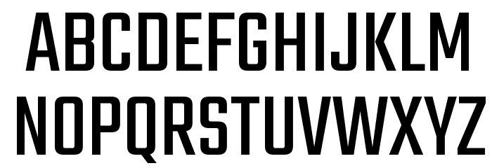
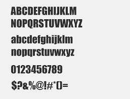

# Typography

## Possible font colours:
- White
- Light grey
- Blue/navy

## Chosen font style and colour (Teko Sans Serif)

The font style that I have decided to choose is the 'Teko sans serif' font. This specific font will be the one I am using for all of the text within my website. I believe it is a rather fitting font style to use for a website based on selling mobile phones since it has a very digital world vibe about it, probably due to the way each of the letters are shaped and structured.

## Alternate font style (Impact)

This is another font style that would've been possible to be included in my website and it is the impact font style. This is because I thought it would be a great idea to include it because it was a classic font that was created during the time windows 98 but the one problem is that it is quite bold, if not too bold. That's one of the main reasons I chose monaco because it is a common font used in typography and it is also not too bold and is easily readable.