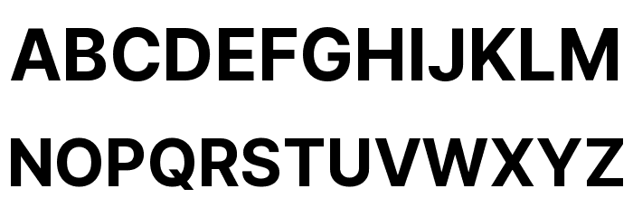

# Typography

## Possible font colours:
- White
- Light grey
- Blue/navy

## Chosen font style and colour (Teko Sans Serif)

The font style that I have decided to choose is the 'Teko sans serif' font. This specific font will be used for any text that isn't the text contained within the nav bar. It is an appealing font and fairly easy to read but only under certain conditions and being in the nav bar is not one of them, so as a result I will be using another font style for the nav bar text.

## Chosen nav bar font style (Inter Sans Serif)

 

The font that I have chosen for the nav bar text is kown as 'inter sans serif'. It may be a simple font style but it is good enough for being the nav bar text. This is because it is more bold which is a key aspect for text like the ones found in the nav bar because the idea of them is to stand out and to also make them easier to click on. Plus, the text will still be fairly easier to read when it changes color due to hover over because of how bold it is.

## Alternate font style (Impact)

This is another font style that would've been possible to be included in my website and it is the impact font style. This is because I thought it would be a great idea to include it because it was a classic font that was created during the time windows 98 but the one problem is that it is quite bold, if not too bold. That's one of the main reasons I chose monaco because it is a common font used in typography and it is also not too bold and is easily readable.