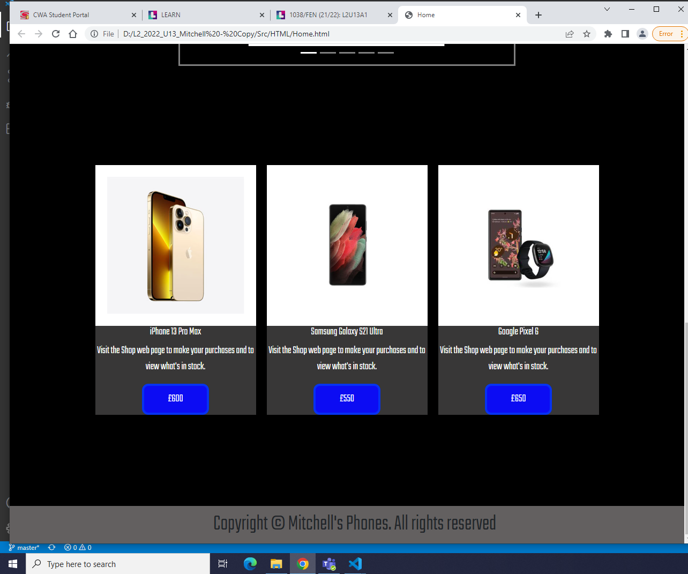
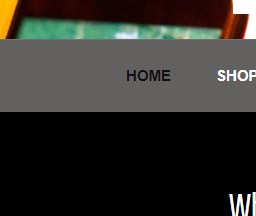
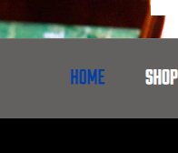
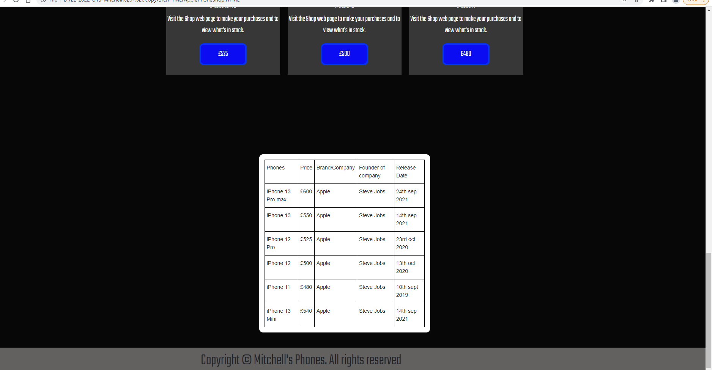
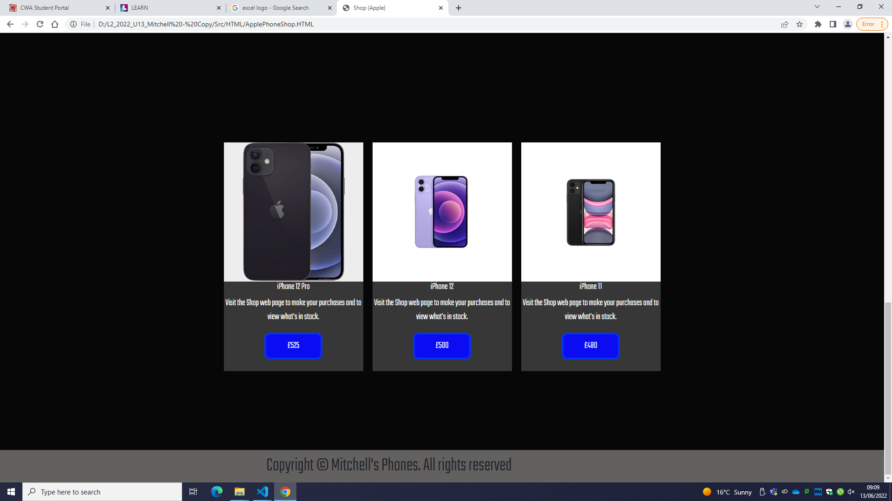
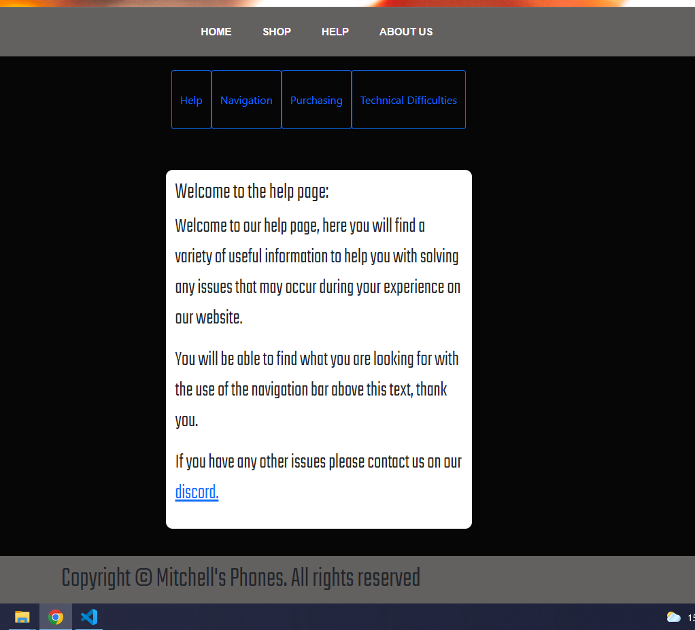
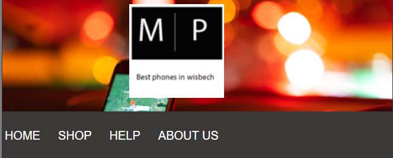
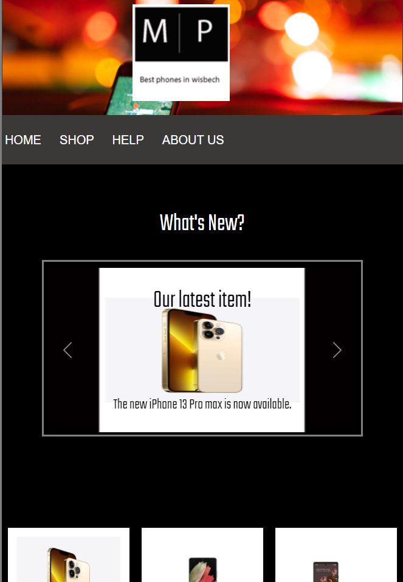

# Test plan

After I have made my website I will firstly, I will go through the website to try and find any faults/issues, after that I'll have my website reviewed by two people and I will then find solutions for all of the improvments that I have recieved or given myself. I will also provide explanation on why I am making these improvements and also reasons for if I agree or disagree with any feedback I recieve from my reviews.

# Evaluation 

After testing my website and seeing how it functions, meets the stakeholders requirements and how appealing it seems I have given my personal opinions on what I believe is the great about the website and what I think I should improve.

Personally, I believe my website meets a majority amount of the stakeholders requirements and their needs. The website is perfectly functional, obviously apart from the purchase page but I did leave a little notification that lets any user know that this hasn't been implemented yet and will be eventually. Apart from that everything else functions completely fine e.g. navigation system, hyperlinks, videos, carousel. I also believe the color scheme is great and will be appealing to stakeholders because it doesn't contain too many colors and not too little, plus it also similary matches the logo of my website that I made on adobe photoshop. I believe the fonts will be fairly readable for people and is rather appealing. I also believe that the images included in the website are at an appropriate size so that they don't come out as compressed and look distorted, plus I have made sure to showcase the most recent phones the most so that they attract more users to go through my website. 

After testing my website I believe that I should add a database at the bottom of each shop web page (apart for the main one), the database will contain the phone names, company name, owner of that company, price of that phone and the date that phone was released. I've decided that I should add this because it will make it easier on customers for them to find what phone they are looking because it is a simple table that provides them with relevant information about the phone e.g. price, brand, release date etc. 

# Improvements (my opinion)

Despite how I believe that the website meets nearly all of the stakeholders requirements, I do still think that there are some improvements that I can make in the future, most likely in version two of the website or some I could just quickly change.

## Improvements 
- shop nav bar compresses with web page
- carousel images darken (hoverover effect)
- include more content on help page

## 1st improvement 

What I mean by the shop nav bar compressing with the web page is that currently it doesn't move the way I would expect when the web page is compressed making it go out of position slightly. This is also the same case for the nav bar on the help page because it is the same design. However, this isn't the case for the main nav bar at the top of each web page, when the page compresses the main nav bar will just look like the mobile version where there are two buttons on each side.

## 2nd Improvement 

This can easily be changed but the images that are included on the carousel can have the cursor change to a pointer wehn it hovers over them. This is so that users are aware that the images are clickable and will take them to another web page. This will just require a little addition to my css. 

## 3rd Improvement 

I did notice that the buttons at the top of the shop page with the logos within them go off the page when the page gets compressed, I'll have to quickly change some of the coding on my css in order to keep them on the screen.

# Changes made

These are the changes that I have made to the website, some of these reasons are because of the reviews I did or becuase of my own opinion of thinking it makes the website look much better.

## Content added

These are the contents that I have added whilst developing my website but was not mentioned in my planning of the website. 
 
### I added:
- Youtube video
- Discord hyperlink
- Banner background image
- Phones database
- Different nav bar font

# Reasons I added them

## Youtube video

Firstly, after doing a website review with Ashley, a piece of feedback he did give me is that I should include a youtube video on my website. After hearing this, I added a youtube video which is a showcase of the iphone 13. 

The reason I agreed to add this piece of content is because it provides a clear showcase of a released phone that is recent and that is something most customers would be looking for in a phone shop, they mostly want the products that are recent with up to date quality and updated features. I also made the video on my website quite big so it is much easier to watch and it isn't too small since I acknowledged that some people may have difficulties in trying to watch it at a small size. 

## Here is the aftermath 

## Here is before the addition

## Nav bar font

Another piece of feedback that Ashley provided me with is that I should change the font for the text on the nav bar because it didn't mix well with the color that it changes to when the cursor hovers over it and the font is a bit too bold, especially when it changed to dark blue which is the color it changed to. Since I agreed with this feedback, I changed the font from 'Teko sans serif' to 'Inter', I also changed the color from dark blue to black,'Teko snas serif' is the font I use for the rest of the text in the website and it does fit well and is very visible since the text is white, but when it comes to the nav bar text and being changed to a darker color, it doesn't work. 

I made these changes because the 'Inter' font style is not too bold like the original font I was using which makes it easier to read when the color changes, having the text change to black is better than dark blue because black is nearly the opposite to the light grey background colour I have which prevents the text from blending in with the background which would make the text hard to read if it did, even though dark blue is an entirely different colour to dark grey, it didn't achieve this as much as the color black. Even though the original is readable for some people, you can definately see how the updated version is much more visible than the original, here is an image of the changes I made and here is an image of what it looked like before this change.

## Here is the aftermath

## Here is before the addition

## Database

When I tested my website to find out if it functions properly and it meets the target audiences needs, I decided that I wanted to add a database at the bottom of each shop web page (apart for the main one).

I decided to add this because it can provide some assistance for a customer to find the right phone for them and also helps them to find it on the webiste. Not only that, but it also provides relevant information about the phone such as the price, brand and release date. Here is an image of the database on the apple phone shop web page.

## Here is the aftermath

## Here is before the addition

## Discord Link

Secondly, the discord hyperlink is included in the text on the help pages to navigate any user that clicks on it to the discord log in page, it pretty much functions like a contact us button, this is so that any user can ask the developers of this website to provide information on a certain issue they had, an actual discord server hasn't been made for this website. I decided to add this to my website because it can indicate to customers that you are clearly reliable and it allows them to know that they can seek assistance from me at any point.

## Here is the aftermath

## Here is before the addition 

## Banner background

Thirdly, I did end up using an image for the background of my banner at the top of each page, I chose this image because it seems very appealing due to its brightness and it stands out from all the other colors included on my website which is great because it is the first thing that will appear on screen when any web page renders in. The reason I decided to add this to my website because it not only looks professional, but it will also display that I like to have an organised layout and design to customers. 

## Here is the aftermath

## Here is before the addition

## Content removed 

These are the contents that I ended up removing which were mentioned in my planning of the website. 

### I removed:
- Swapped footer contents with copyright information
- Contact us page
- Reviews page

## Reasons I removed them

Firstly, I swapped the original contents of the footer (website information, read review button and contact us button) with copyright information, this is because the reviews page would be unnecessary because the website is completely new so it can be added in a future update, the contact us button isn't necessary either becuase I now have a discord link in the help pages. This also means the contact us page and reviews page won't be included in the about us and help pages because they are completely unecessary to have right now.

## Mobile version

Like the PC version I do believe the mobile version works fine and it is structured appropriately to fit onto a mobile phones screen. It also highlights that I acknowledged the fact that some people may not own a PC to access the other version of the website so I made a mobile version which increases the amount of people that can access this website by a huge amount.

# Opening view of mobile version

